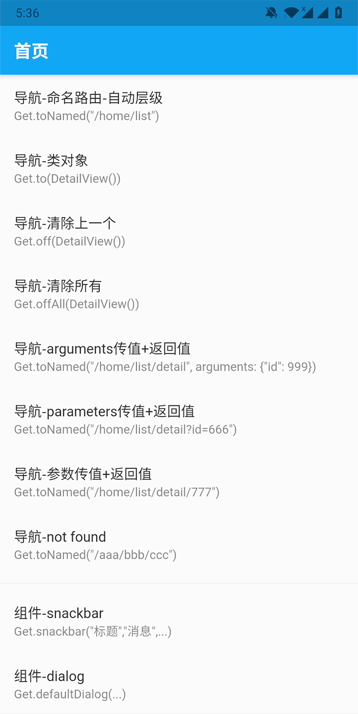

# getx_quick_start

## 参考

- getx pub
  https://github.com/jonataslaw/getx

- getx cli
  https://marketplace.visualstudio.com/items?itemName=get-snippets.get-snippets

- getx pattern
  https://kauemurakami.github.io/getx_pattern/

## 全面启用 getx4 + null-safety 空安全

## 前言

这个仓库只是对 getx 功能就行整理和研究，实战中的项目代码架构不在这里实现（可能用 getx 重写一版去年新闻客户端 APP）。

## 研究重点

1. 功能覆盖
2. 三端表现：android ios、web、桌面

## 官仓

https://pub.flutter-io.cn/packages/get

## vscode 插件

https://marketplace.visualstudio.com/items?itemName=get-snippets.get-snippets

## 开发环境

- Flutter 2.1.0-12.1.pre
- Dart 2.13.0
- get: ^4.1.3

## 参考

- [Sound null safety](https://dart.dev/null-safety)
- [getx_pattern](https://kauemurakami.github.io/getx_pattern/)
- [GetX Snippets](https://marketplace.visualstudio.com/items?itemName=get-snippets.get-snippets)
